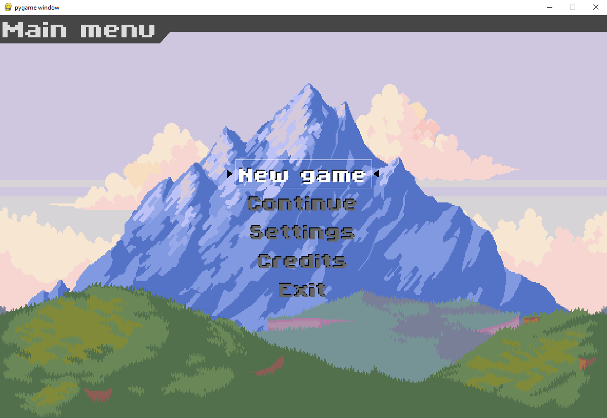
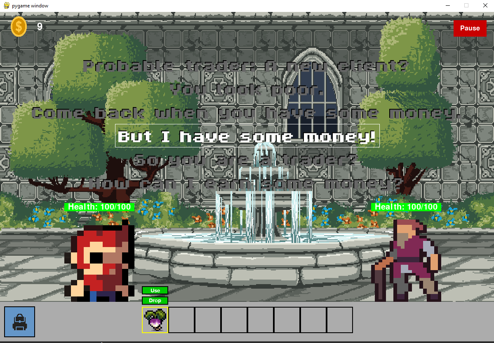
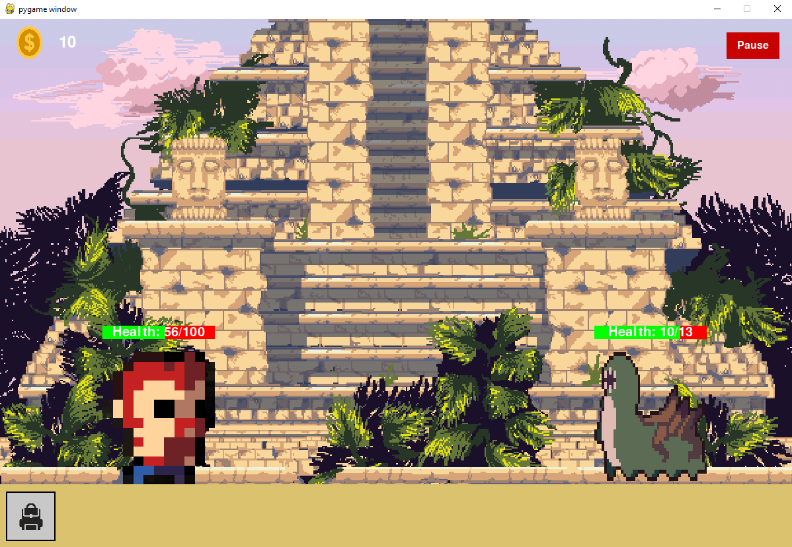

# Little Journey

## Description

This project is a 2D arcade-style adventure game that combines story-driven exploration with engaging gameplay mechanics. Players control a character who interacts with various NPCs to uncover and progress through the storyline. Along the way, players encounter battles with monsters, collect coins, and gather items to aid them in their journey.

## Github Link

https://github.com/MTY621/LittleJourney

## Programming languages and technologies used

The project is implemented entirely in Python, using several libraries to enhance functionality. Pygame is used for creating the game’s 2D graphics, managing game logic, animations, and interactions. Pygame-menu is utilized for building interactive menus, while Mutagen is employed to handle and manipulate audio files for the game’s soundtrack and sound effects. These technologies work together to deliver a seamless and immersive gaming experience.

## Setup Instructions

To run the game, simply clone the repository and install the required dependencies by running `pip install -r requirements.txt` in your terminal. This will automatically install all the necessary libraries, including **Pygame**, **Pygame-menu**, and **Mutagen**, to ensure the game functions properly. Once the dependencies are installed, you can run the main script to start the game.

## Screenshots

# Contributions

* **Belciug Matei**: Worked on the storyline, creating the narrative that drives the game’s progression. He also designed and implemented the in-game menus, ensuring a smooth and intuitive user experience. Additionally, Matei was responsible for integrating sound into the game, enhancing the overall atmosphere, and sourcing the images used for the background and characters.
* **Bigan Radu-Cristin**: Focused on the animations, implementing smooth and dynamic character movements. He also worked on the inventory system and health bar, ensuring functional and visually appealing mechanics. Additionally, Radu edited the character and item sprites, standardizing their format for consistent presentation throughout the game.
## Difficulties
* **Animation Synchronization**: One of the challenges we faced was synchronizing the animations without blocking the program, as using sleep functions would freeze the game. To solve this, we implemented a queue for animations, where each animation is played for a set amount of time, and once the animation is completed, it is removed from the queue. This approach ensured that the animations played smoothly for both the player and NPCs without causing delays in the game’s execution.
* **Image Standardization**: Another difficulty arose from the various image formats we received for characters and items. These images, sourced from the internet, came in different forms and sizes. To resolve this, we edited the images by cropping them to only include the character or item with a transparent background. We then standardized the images by scaling them to a preset size when loading them into the game, ensuring consistency across the visuals.